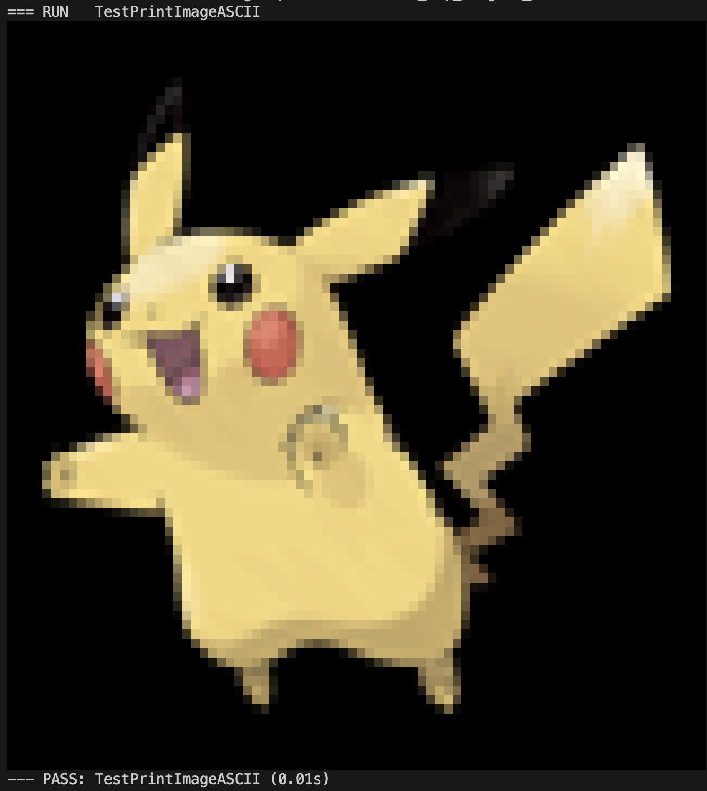
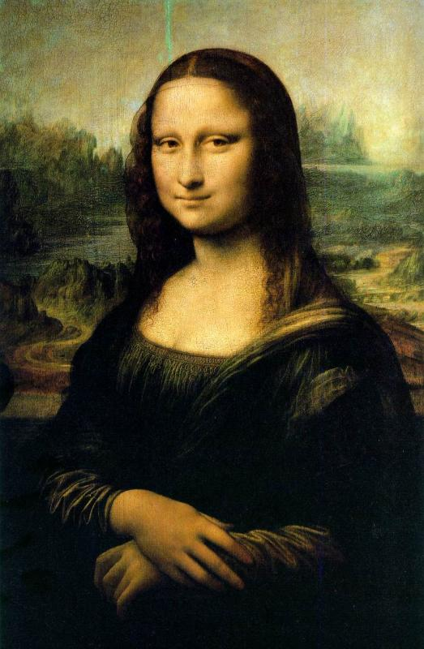
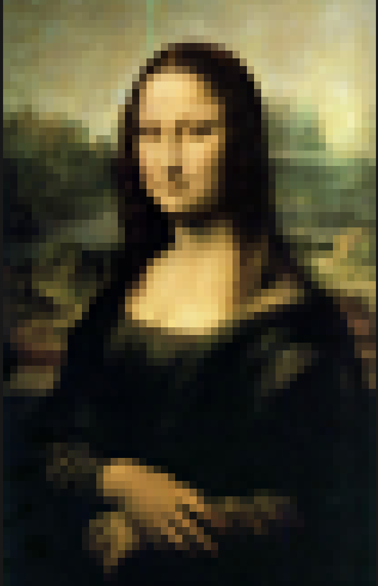
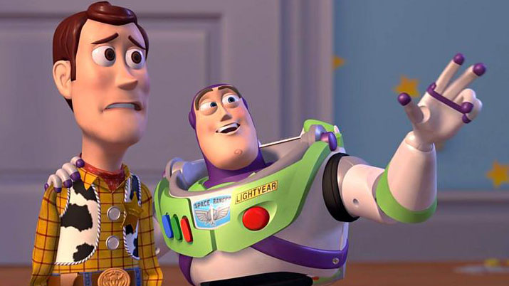
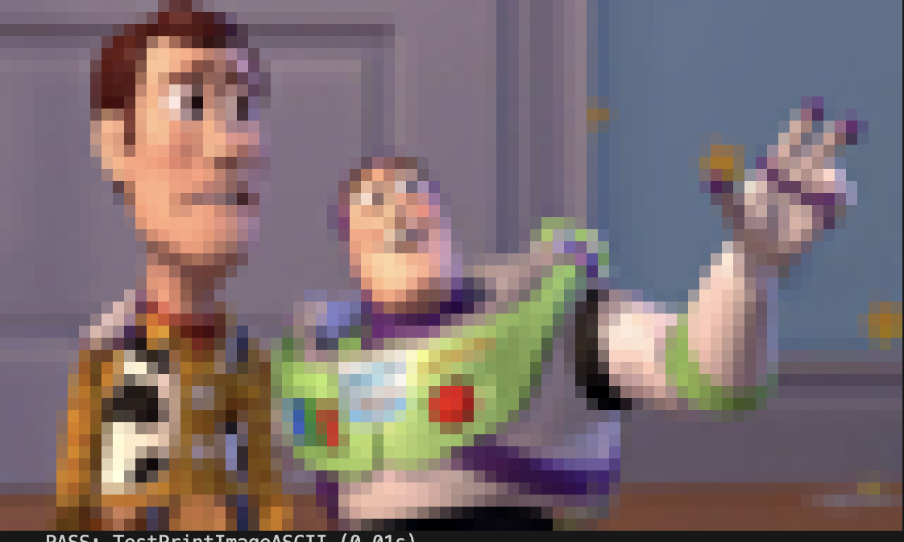

# GO Package for Image to ASCII in color

This is a simple package that converts an image to ASCII in color that can be printed to the terminal. It was created by pair programming with GPT4 as I needed something simple, yet beautiful ascii art generator for another project.

Since the package returns the ASCII image as a slice of strings, you can easily print it to the terminal or save it to a file. It is also possible to have your own texts printed either to the right or left of the image by appending the text to the slice of strings.

Inspiration for this package came from [image-to-ascii-art](https://github.com/Sayutizxc/image-to-ascii-art) [ascii-image-converter](https://github.com/TheZoraiz/ascii-image-converter)

## Features

- [x] Convert an image to ASCII in color
- [x] Maintains aspect ratio of the original image
- [x] Returns the ASCII image as a slice of strings
- [x] Provides a loading function for image paths

## Installation

If you want to use this package in your go project, you can install it using the following command:

```bash
go get github.com/1-ashraful-islam/image2ascii
```

## Usage

```go
package main

import (
  "fmt"

  im2ascii "github.com/1-ashraful-islam/image-to-ascii"
)

func main() {
  //load image
  img, err := im2ascii.LoadImage("path/to/image.jpg")
  if err != nil {
    fmt.Println(err)
    return
  }
  //create ascii image
  asciiImage, err := im2ascii.CreateASCIIImage(img, 80, 80)
  if err != nil {
    fmt.Println(err)
    return
  }
  //print ascii image
  for _, line := range asciiImage {
    fmt.Println(line)
  }
}
```

## Testing

To run the tests, you can use the following command:

```bash
go test ./... -v -cover
```

## Example output

| Original Image | ASCII Image |
|---|---|
| | |
| | |
| | |

Original Images (left column) used in the examples are not property of the author and were taken from the internet. They are used for educational purposes only.
